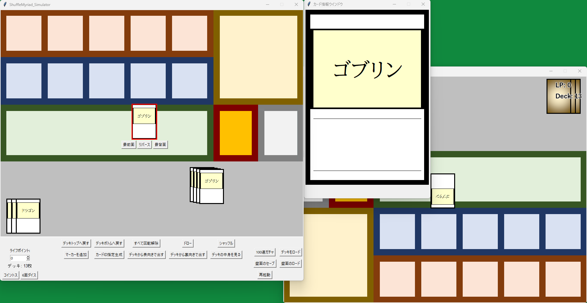

# Card Game Simulator - Shuffle Myriad -



手軽に使える多目的TCG (トレーディングカードゲーム) シミュレーターです。
カードゲームのテストプレイや、一人回し、盤面共有などに活用できます。

## 概要

ShuffleMyriad_Simulator は、ローカル環境で動作するカードゲームシミュレーターです。
ユーザーが用意したカード画像とデッキリストを使用して、直感的な操作でカードの配置、移動、状態変更などを行うことができます。
対戦者用のミラーウィンドウも備えており、リモートでの画面共有と組み合わせることで、オンラインでの対戦テストもサポートします。

## 主な機能

* **デッキ操作:**
    * テキストファイルからのデッキロード (`deck` フォルダ)
    * カードのドロー、シャッフル
    * デッキトップ/ボトムへのカード移動
    * デッキ内容の確認と特定カードの取り出し
* **カード操作:**
    * ドラッグ＆ドロップによる自由な配置
    * カードのリバース (表/裏の切り替え)
    * カードの回転 (縦向き/横向きの切り替え)
    * カードの削除
    * 選択カードの最前面/最背面への移動
    * カードIDのクリップボードへのコピー
* **ゲーム補助機能:**
    * ライフポイントカウンター
    * マーカーの追加、テキスト編集、移動
    * コイントス、6面ダイスロール
    * 盤面全体の保存とロード (`save` フォルダ)
* **表示機能:**
    * 選択したカードの詳細情報表示ウィンドウ
    * 対戦者用の盤面ミラー表示ウィンドウ (上下左右反転)
* **その他:**
    * アプリケーションの再起動

## 動作環境

* Python 3.x
* Pillow (PIL Fork) ライブラリ
* Tkinter (Python標準ライブラリ)
* (推奨) `Yu Gothic Bold` (YuGothB.ttc) フォント: マーカーやダイス結果の表示に使用されます。Windowsには標準で含まれていることが多いですが、他のOSでは別途インストールが必要な場合があります。フォントがない場合でも、デフォルトフォントで動作します。

## ファイル構造と準備

本シミュレーターを使用するには、以下のファイルとフォルダ構造を準備してください。

```
ShuffleMyriad_Simulator/
├── ShuffleMyriad_Simulator.py  (シミュレータースクリプト)
├── ShuffleMyriad_DeckEditor.py (デッキ編集スクリプト)
├── CardList.csv                (カード情報リスト - スクリプト直下)
├── config.cfg                  (設定ファイル - オプション)
│
├── deck/                       (デッキファイル格納用)
│   └── (例) my_deck.txt
│
├── save/                       (盤面保存データ格納用)
│   └── (例) save_20250530100000.txt
│
├── card-img/                   (カード画像格納用)
│   └── (例) card_001.png
│   └── (例) card_002.png
│
└── resource/                   (リソース画像格納用)
    ├── playmat.png
    ├── reverse.png
    ├── noimage.png
    └── unknown.png
```

* **`ShuffleMyriad_Simulator.py`**: このアプリケーションのメインスクリプトです。
* **`CardList.csv`**: (必須) カードのID、名称、EX値などを定義するCSVファイルです。詳細は後述。
* **`config.cfg`**: (オプション) 対戦者ウィンドウの更新レートなどを設定できます。存在しない場合はデフォルト値が使用されます。
    ```ini
    opponent_refresh_rate=120
    ```
* **`deck/` フォルダ**: (必須、初回は空でも可)
    * デッキデータを格納します (`.txt` 形式)。詳細は後述。
    * 「デッキをロード」機能でこのフォルダが開かれます。
    * 「100連ガチャ」機能で作成されたデッキもこのフォルダに保存されます。
* **`save/` フォルダ**: (必須、初回は空でも可)
    * 「盤面のセーブ」機能で作成された盤面状態ファイルがここに保存されます。
    * 「盤面のロード」機能でこのフォルダが開かれます。
* **`card-img/` フォルダ**: (必須)
    * カードの画像ファイル (`.png` 推奨) を格納します。
    * ファイル名は `カードID.png` (例: `mycard001.png`) としてください。カードIDはデッキファイルや `CardList.csv` で使用するものと一致させます。
* **`resource/` フォルダ**: (必須)
    * `playmat.png`: プレイマットとして表示される背景画像 (推奨サイズ: 960x720px)。
    * `reverse.png`: カードの裏面として表示される画像 (推奨サイズ: 78x111px)。
    * `noimage.png`: `card-img/` フォルダに該当するカード画像がない場合に使用される代替画像 (推奨サイズ: 78x111px)。
    * `unknown.png`: 選択カード情報ウィンドウで、まだ公開されていない（裏向きの）カードを表示する際の代替画像 (推奨サイズ: 390x555px)。

    これらのリソース画像がない場合、一部機能が正しく表示されない可能性があります。最低限、`noimage.png` があれば、画像なしカードのエラーを減らせます。

## インストールと実行

1.  **リポジトリのダウンロード/クローン:**
    このリポジトリをローカルマシンにダウンロードまたはクローンします。
    ```bash
    git clone https://github.com/galactic-pebble/ShuffleMyriad.git
    ```

2.  **必要なライブラリのインストール:**
    ターミナルまたはコマンドプロンプトで以下のコマンドを実行して、必要なライブラリをインストールします。
    ```bash
    pip install -r requirements.txt
    ```

3.  **シミュレーターの実行:**
    ターミナルまたはコマンドプロンプトで、`ShuffleMyriad_Simulator.py` があるディレクトリに移動し、以下のコマンドを実行します。
    ```bash
    python ShuffleMyriad_Simulator.py
    ```

4.  **デッキ編集スクリプトの実行:**
    ターミナルまたはコマンドプロンプトで、`ShuffleMyriad_DeckEditor.py` があるディレクトリに移動し、以下のコマンドを実行します。
    ```bash
    python ShuffleMyriad_DeckEditor.py
    ```

## 基本的な使い方

* **デッキのロード:**
    1.  メインウィンドウ下部の「デッキをロード」ボタンをクリックします。
    2.  `deck` フォルダが開くので、使用したいデッキファイル (`.txt`) を選択します。
* **カード操作:**
    * **移動:** カードを左クリックでドラッグ＆ドロップします。
    * **選択:** カードを左クリックすると選択状態になります（赤い枠線が表示されます）。
    * **リバース:** カードを選択後、カード下に表示される「リバース」ボタン、またはメインウィンドウ下部の「リバース」ボタンをクリックします。
    * **回転:** カードを右クリックします。
    * **情報表示:** カードを選択すると、カード情報ウィンドウにそのカードの拡大画像が表示されます（カードが公開状態の場合）。
* **ショートカットキー:**
    * `Delete`: 選択中のカードまたはマーカーを削除します。
    * `Ctrl + T`: 選択中のカードをデッキの一番上に戻します。
    * `Ctrl + B`: 選択中のカードをデッキの一番下に戻します。
    * `Ctrl + F`: 選択中のカードまたはマーカーを最前面に移動します。
    * `Ctrl + R`: 選択中のカードまたはマーカーを最背面に移動します。
    * `Ctrl + C`: 選択中のカードのIDをクリップボードにコピーします。
* **マーカー:**
    * 「マーカーを追加」ボタンで新しいマーカーを盤面に追加します。
    * マーカーを選択した状態でダブルクリックすると、テキスト編集ウィンドウが開きます。
* **その他のウィンドウ:**
    * 初回起動時に「カード情報ウィンドウ」と「対戦者用ウィンドウ」が自動で開きます。これらは閉じることができません（最小化は可能です）。
    * 「デッキの中身を見る」ボタンで、現在のデッキ内容をリストで確認し、特定のカードを選んで場に出すことができます。

## ファイルフォーマット

### デッキファイル (`.txt`)

デッキ編集スクリプトでデッキを作成できます。
デッキはテキストファイル形式で、1行に1つのカードIDを記述します。

```
card_id_001
card_id_002
card_id_003
...
[EX]
ex_card_id_001
ex_card_id_002
...
[Resource]
my_reverse.png
my_playmat.png
```

* **メインデッキ:** ファイルの最初から `[EX]` または `[Resource]` セクションが現れるまで記述されたカードIDがメインデッキのカードとして読み込まれます。
* **`[EX]` セクション:** (オプション) この行以降に記述されたカードIDはEXデッキのカードとして扱われ、ロード時に特定の初期位置に配置されます。
* **`[Resource]` セクション:** (オプション)
    * 1行目にカスタムリバースカード画像ファイル名 (例: `my_reverse.png`) を指定できます。ファイルは `resource` フォルダに配置してください。
    * 2行目にカスタムプレイマット画像ファイル名 (例: `my_playmat.png`) を指定できます。ファイルは `resource` フォルダに配置してください。

### `CardList.csv`

カードの情報を定義するCSVファイルです。スクリプトと同じ階層に配置してください。
文字コードは `UTF-8` で、1行に1カードの情報を以下の形式で記述します。

`カードID,カード名,EX値`

例:
```csv
card001,ゴブリン,0
card002,戦士,0
card003,姫,2
card004,ドラゴン,1
```

* **カードID:** `card-img/` フォルダ内の画像ファイル名 (拡張子除く) やデッキファイルで使用するIDと一致させてください。
* **カード名:** 「デッキの中身を見る」ウィンドウなどで表示される名前です。
* **EX値:**
    * `0`: 通常のカード
    * `1`: EXデッキに入るカード (「100連ガチャ」機能でEXデッキ候補として扱われます)
    * `2`以上: デッキ編集スクリプトの「100連ガチャ」機能でメインデッキには含まれなくなるカード (主にガチャ対象外の特殊カードなどに使用)

## ライセンス

このプロジェクトはMITライセンスの下で公開されています。

---

**注意**: このシミュレーターは個人的な使用を目的としています。商用利用や特定のカードゲームの著作権には十分ご注意ください。
